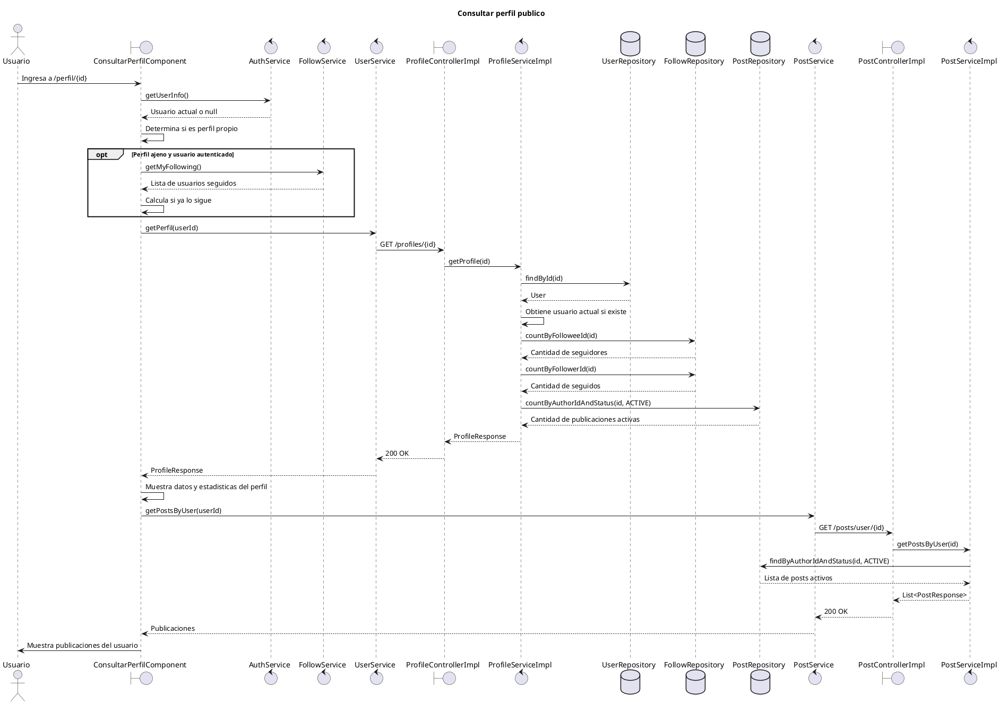

# Diagrama de secuencia - Consultar perfil publico

Este diagrama representa el flujo principal para consultar el perfil publico de un usuario en MyPresentPast.

El objetivo es mantener el diagrama legible para incluirlo como captura en el documento de desarrollo de producto. Por eso se dejan fuera del flujo principal acciones posteriores como seguir/dejar de seguir, abrir paneles de seguidores/seguidos, colecciones y favoritos del perfil propio.

## Diagrama PlantUML

## Detalles importantes

- La ruta frontend real es `/perfil/:id`, asociada a `ConsultarPerfilComponent`.
- `ConsultarPerfilComponent` escucha cambios de `paramMap`; si cambia el `id`, limpia estado y vuelve a cargar el perfil.
- Antes de cargar los datos, el componente reinicia el estado visual de la pantalla: limpia publicaciones, colecciones, usuario cargado, paneles/modales abiertos y vuelve a mostrar la seccion de publicaciones.
- Para el perfil publico ajeno, el componente no carga colecciones ni favoritos. Esas secciones son para el perfil propio.
- El endpoint real de perfil es `GET /profiles/{id}` y es publico para consultas `GET`.
- `ProfileServiceImpl.getProfile(id)` no solo carga datos basicos del usuario: tambien calcula `isSelf`, `following`, `postCount`, `followerCount` y `followingCount`.
- Si hay usuario autenticado y el perfil no es propio, el backend calcula `following` con `FollowRepository.existsByFollowerIdAndFolloweeId(currentUserId, userId)`.
- En frontend tambien se consulta `FollowService.getMyFollowing()` para calcular `siguiendo`. Esto duplica parcialmente el campo `following` que ya viene en `ProfileResponse`.
- Luego de cargar el perfil, el frontend pide las publicaciones con `PostService.getPostsByUser(userId)`, que llama a `GET /posts/user/{id}`.
- Las publicaciones se cargan en una request separada al perfil. No forman parte de `ProfileResponse`.

## Alternativas y errores relevantes

Estos casos pueden mencionarse en el documento sin agregarlos al diagrama principal, para evitar que la captura quede demasiado grande:

- Usuario inexistente: `ProfileServiceImpl.getProfile(id)` lanza `ResourceNotFoundException`; `GlobalExceptionHandler` responde 404.
- Usuario no autenticado: el perfil publico se puede consultar igual; `isSelf=false` y `following=false`.
- Perfil propio: el frontend puede cargar colecciones del usuario y mostrar secciones de colecciones/favoritos, pero no corresponde al flujo de perfil publico ajeno.
- Usuario sin publicaciones activas: `PostServiceImpl.getPostsByUser(id)` lanza `ResourceNotFoundException` con el mensaje `No hay publicaciones disponibles para mostrar`; el frontend solo lo loguea y conserva `posts=[]`.
- Acciones posteriores como seguir, dejar de seguir, abrir seguidores o abrir seguidos no pertenecen a la carga inicial del perfil.

## Mejoras futuras

- Evaluar si conviene usar directamente `ProfileResponse.following` en frontend y evitar la consulta adicional `FollowService.getMyFollowing()` para calcular `siguiendo`.
- Evaluar si `GET /posts/user/{id}` deberia devolver lista vacia cuando el usuario no tiene publicaciones activas, en lugar de responder 404.

## Referencias de codigo

- Frontend: `mypresentpast-frontend/src/app/app.routes.ts`
- Frontend: `mypresentpast-frontend/src/app/features/usuarios/consultar-perfil/consultar-perfil.component.ts`
- Frontend: `mypresentpast-frontend/src/app/features/usuarios/consultar-perfil/consultar-perfil.component.html`
- Frontend: `mypresentpast-frontend/src/app/core/services/user/user.service.ts`
- Frontend: `mypresentpast-frontend/src/app/core/services/post/post.service.ts`
- Frontend: `mypresentpast-frontend/src/app/core/services/follow/follow.service.ts`
- Backend: `mypresentpast-backend/src/main/java/com/mypresentpast/backend/controller/ProfileController.java`
- Backend: `mypresentpast-backend/src/main/java/com/mypresentpast/backend/controller/impl/ProfileControllerImpl.java`
- Backend: `mypresentpast-backend/src/main/java/com/mypresentpast/backend/service/impl/ProfileServiceImpl.java`
- Backend: `mypresentpast-backend/src/main/java/com/mypresentpast/backend/dto/response/ProfileResponse.java`
- Backend: `mypresentpast-backend/src/main/java/com/mypresentpast/backend/repository/UserRepository.java`
- Backend: `mypresentpast-backend/src/main/java/com/mypresentpast/backend/repository/FollowRepository.java`
- Backend: `mypresentpast-backend/src/main/java/com/mypresentpast/backend/repository/PostRepository.java`
- Backend: `mypresentpast-backend/src/main/java/com/mypresentpast/backend/controller/impl/PostControllerImpl.java`
- Backend: `mypresentpast-backend/src/main/java/com/mypresentpast/backend/service/impl/PostServiceImpl.java`
