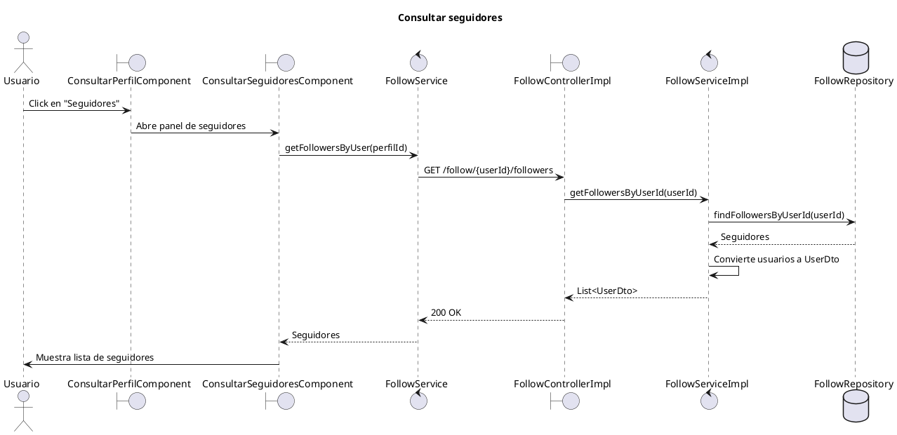

# Diagrama de secuencia - Consultar seguidores

Este diagrama representa el flujo principal para consultar los seguidores de un perfil en MyPresentPast.

El objetivo es mantener el diagrama legible para incluirlo como captura en el documento de desarrollo de producto. Por eso se dejan fuera del flujo principal acciones posteriores del panel, como cerrarlo o navegar al perfil de un seguidor.

## Diagrama PlantUML

## Detalles importantes

- El panel de seguidores se abre desde `ConsultarPerfilComponent.verSeguidores()`, que activa `mostrarPanelSeguidores`.
- `ConsultarPerfilComponent` le pasa el `userId` actual al panel mediante `[perfilId]="userId"`.
- El componente real es `ConsultarSeguidoresComponent`; consulta seguidores del perfil recibido por `perfilId`.
- El endpoint real usado por este componente es `GET /follow/{userId}/followers`.
- El endpoint `GET /follow/my-followers` existe para el caso “mis seguidores”, pero no es el que usa este componente cuando recibe `perfilId`.
- Para este endpoint especifico no interviene `SecurityUtils.getCurrentUserId()`, porque se consultan los seguidores de un `userId` recibido por path.
- `FollowServiceImpl.getFollowersByUserId(userId)` consulta `FollowRepository.findFollowersByUserId(userId)` y mapea cada `User` a `UserDto`.
- Si no hay seguidores, el backend devuelve una lista vacia y el frontend muestra `Sin seguidores.`

## Alternativas y errores relevantes

Estos casos pueden mencionarse en el documento sin agregarlos al diagrama principal, para evitar que la captura quede demasiado grande:

- Error al cargar seguidores: `ConsultarSeguidoresComponent` muestra `No se pudo cargar la lista de seguidores.` y desactiva `loading`.
- Lista vacia: el componente muestra `Sin seguidores.`
- Cerrar panel: `volverAtras()` emite `cerrar`, y el padre oculta el panel.
- Click en un seguidor: `irAPerfil(userId)` navega a `/perfil/{userId}` y luego cierra el panel.
- `GET /follow/my-followers` corresponde al caso “mis seguidores”, pero no a este componente cuando recibe `perfilId`.

## Referencias de codigo

- Frontend: `mypresentpast-frontend/src/app/features/usuarios/consultar-perfil/consultar-perfil.component.html`
- Frontend: `mypresentpast-frontend/src/app/features/usuarios/consultar-perfil/consultar-perfil.component.ts`
- Frontend: `mypresentpast-frontend/src/app/features/usuarios/consultar-seguidores/consultar-seguidores.component.ts`
- Frontend: `mypresentpast-frontend/src/app/features/usuarios/consultar-seguidores/consultar-seguidores.component.html`
- Frontend: `mypresentpast-frontend/src/app/core/services/follow/follow.service.ts`
- Backend: `mypresentpast-backend/src/main/java/com/mypresentpast/backend/controller/FollowController.java`
- Backend: `mypresentpast-backend/src/main/java/com/mypresentpast/backend/controller/impl/FollowControllerImpl.java`
- Backend: `mypresentpast-backend/src/main/java/com/mypresentpast/backend/service/impl/FollowServiceImpl.java`
- Backend: `mypresentpast-backend/src/main/java/com/mypresentpast/backend/repository/FollowRepository.java`
- Backend: `mypresentpast-backend/src/main/java/com/mypresentpast/backend/dto/UserDto.java`
