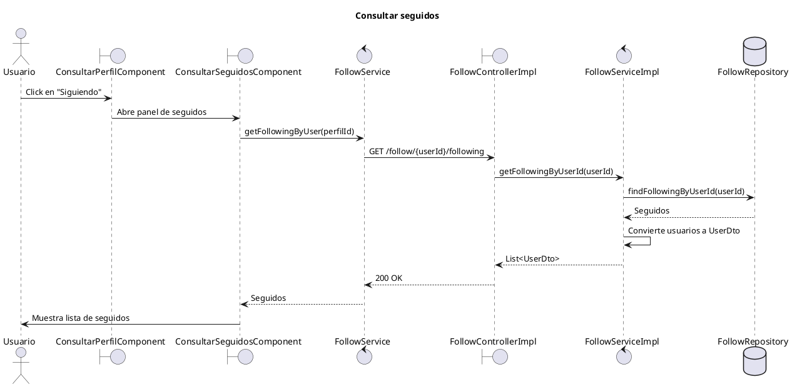

# Diagrama de secuencia - Consultar seguidos

Este diagrama representa el flujo principal para consultar los usuarios seguidos por un perfil en MyPresentPast.

El objetivo es mantener el diagrama legible para incluirlo como captura en el documento de desarrollo de producto. Por eso se dejan fuera del flujo principal acciones posteriores del panel, como cerrarlo, navegar al perfil de un usuario o dejar de seguir.

## Diagrama PlantUML

## Detalles importantes

- El panel de seguidos se abre desde `ConsultarPerfilComponent.verSeguidos()`, que activa `mostrarPanelSeguidos`.
- `ConsultarPerfilComponent` le pasa el `userId` actual al panel mediante `[perfilId]="userId"`.
- Tambien le pasa `[esMiPerfil]="esMiPerfil"` para decidir si muestra el boton `Dejar de seguir`.
- El componente real es `ConsultarSeguidosComponent`; consulta seguidos del perfil recibido por `perfilId`.
- El endpoint real usado por este componente es `GET /follow/{userId}/following`.
- El endpoint `GET /follow/my-following` existe para el caso “mis seguidos”, pero no es el que usa este componente cuando recibe `perfilId`.
- Para este endpoint especifico no interviene `SecurityUtils.getCurrentUserId()`, porque se consultan los seguidos de un `userId` recibido por path.
- `FollowServiceImpl.getFollowingByUserId(userId)` consulta `FollowRepository.findFollowingByUserId(userId)` y mapea cada `User` a `UserDto`.
- Si no hay seguidos, el backend devuelve una lista vacia y el frontend muestra `Sin seguidos.`

## Alternativas y errores relevantes

Estos casos pueden mencionarse en el documento sin agregarlos al diagrama principal, para evitar que la captura quede demasiado grande:

- Error al cargar seguidos: `ConsultarSeguidosComponent` muestra `No se pudo cargar la lista de seguidos.` y desactiva `loading`.
- Lista vacia: el componente muestra `Sin seguidos.`
- Cerrar panel: `volverAtras()` emite `cerrar`, y el padre oculta el panel.
- Click en un usuario seguido: `irAPerfil(userId)` navega a `/perfil/{userId}` y luego cierra el panel.
- Dejar de seguir: solo aparece si `esMiPerfil=true`; llama a `FollowService.unfollowUser(userId)`, elimina el usuario de la lista local y emite `usersDejarDeSeguir`.
- `GET /follow/my-following` corresponde al caso “mis seguidos”, pero no a este componente cuando recibe `perfilId`.
- Si se documenta `Dejar de seguir`, conviene hacerlo como mini-diagrama separado porque dispara otro endpoint y modifica contadores del perfil.

## Referencias de codigo

- Frontend: `mypresentpast-frontend/src/app/features/usuarios/consultar-perfil/consultar-perfil.component.html`
- Frontend: `mypresentpast-frontend/src/app/features/usuarios/consultar-perfil/consultar-perfil.component.ts`
- Frontend: `mypresentpast-frontend/src/app/features/usuarios/consultar-seguidos/consultar-seguidos.component.ts`
- Frontend: `mypresentpast-frontend/src/app/features/usuarios/consultar-seguidos/consultar-seguidos.component.html`
- Frontend: `mypresentpast-frontend/src/app/core/services/follow/follow.service.ts`
- Backend: `mypresentpast-backend/src/main/java/com/mypresentpast/backend/controller/FollowController.java`
- Backend: `mypresentpast-backend/src/main/java/com/mypresentpast/backend/controller/impl/FollowControllerImpl.java`
- Backend: `mypresentpast-backend/src/main/java/com/mypresentpast/backend/service/impl/FollowServiceImpl.java`
- Backend: `mypresentpast-backend/src/main/java/com/mypresentpast/backend/repository/FollowRepository.java`
- Backend: `mypresentpast-backend/src/main/java/com/mypresentpast/backend/dto/UserDto.java`
