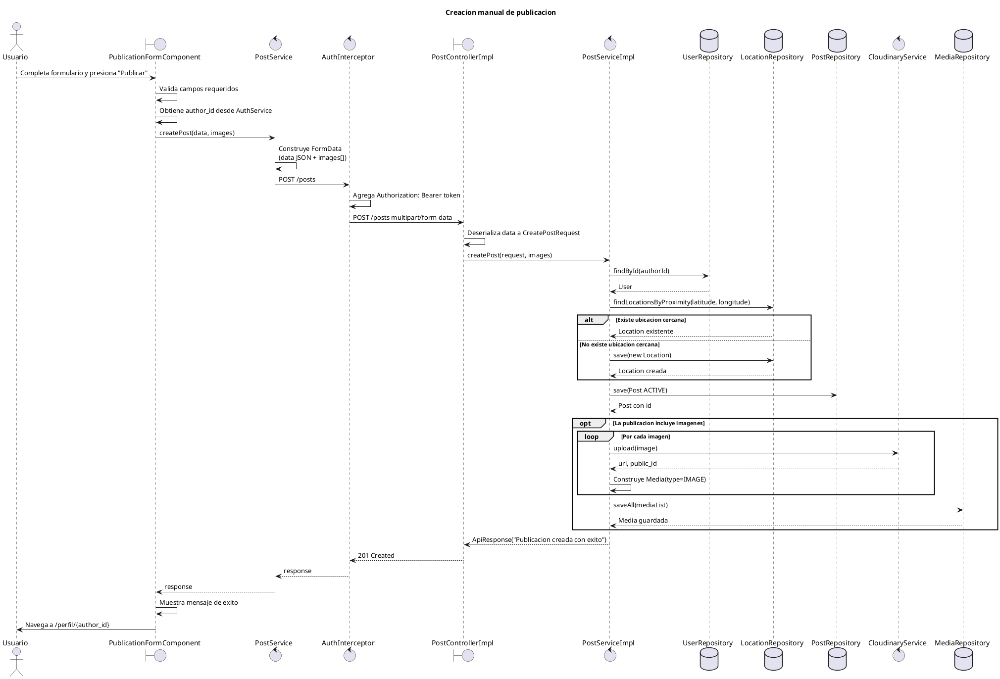

# Diagrama de secuencia - Creacion de publicacion

Este diagrama representa el flujo principal de creacion manual de una publicacion en MyPresentPast.

El objetivo es mantener el diagrama legible para incluirlo como captura en el documento de desarrollo de producto. Por eso se dejan fuera del flujo principal algunos detalles previos o transversales, que quedan documentados en las notas posteriores.

## Diagrama PlantUML

## Detalles importantes

- El diagrama cubre solo la creacion manual de publicaciones. No incluye el flujo de generacion con IA.
- La direccion se obtiene antes del submit desde el mapa mediante geocodificacion inversa con Nominatim/OpenStreetMap.
- Las imagenes se comprimen en el frontend antes de agregarse al `FormData`.
- El token JWT no se agrega manualmente en el componente ni en `PostService`: lo incorpora `AuthInterceptor`.
- El backend recibe un request `multipart/form-data` con:
  - `data`: JSON serializado con titulo, contenido, fecha, direccion, categoria, latitud, longitud, `is_by_ia` y `author_id`.
  - `images`: lista opcional de imagenes.
- La configuracion de Jackson usa `SNAKE_CASE`, por eso campos enviados como `author_id` e `is_by_ia` se mapean a `authorId` e `isByIA`.
- Al crear el post, el backend asigna `postedAt = LocalDate.now()` y `status = ACTIVE`.
- Cloudinary forma parte del flujo principal porque la subida de imagenes ocurre durante la creacion del post.
- La respuesta del backend es un `ApiResponse` con mensaje de exito; no devuelve el post creado ni su id.
- Tras la creacion exitosa, el frontend navega al perfil del usuario autor.

## Alternativas y errores relevantes

Estos casos pueden mencionarse en el documento sin agregarlos al diagrama principal, para evitar que la captura quede demasiado grande:

- Formulario invalido: el frontend marca los campos y no envia el request.
- Usuario no autenticado o sin `author_id`: el frontend muestra error y no envia el request.
- Token ausente, invalido o expirado: la peticion puede ser rechazada con `401 Unauthorized`.
- Usuario inexistente en backend: `UserRepository.findById(authorId)` falla y se devuelve error.
- Mas de 5 imagenes: el backend rechaza la publicacion.
- Error al subir imagen a Cloudinary: se interrumpe la creacion y se devuelve error.
- JSON `data` invalido: el controlador no puede deserializar `CreatePostRequest`.

## Referencias de codigo

- Frontend: `mypresentpast-frontend/src/app/features/publicaciones/publication-form/publication-form.component.ts`
- Frontend: `mypresentpast-frontend/src/app/core/services/post/post.service.ts`
- Frontend: `mypresentpast-frontend/src/app/auth.interceptor.ts`
- Backend: `mypresentpast-backend/src/main/java/com/mypresentpast/backend/controller/PostController.java`
- Backend: `mypresentpast-backend/src/main/java/com/mypresentpast/backend/controller/impl/PostControllerImpl.java`
- Backend: `mypresentpast-backend/src/main/java/com/mypresentpast/backend/service/impl/PostServiceImpl.java`
- Backend: `mypresentpast-backend/src/main/java/com/mypresentpast/backend/repository/LocationRepository.java`

