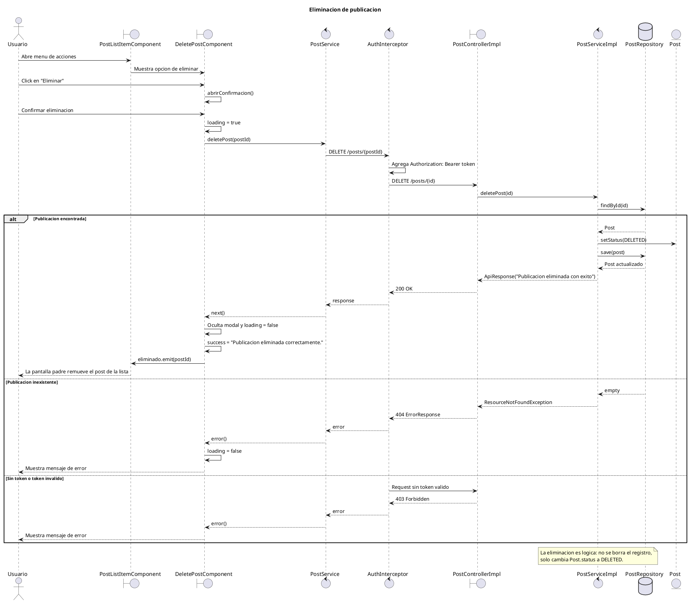

# Diagrama de secuencia - Eliminacion de publicacion

## Diagrama PlantUML

## Detalles importantes

- El nombre real del servicio frontend es `PostService`, no `PublicacionService`.
- La accion de eliminar se ofrece desde `PostListItemComponent`, que muestra el menu de acciones y renderiza `DeletePostComponent` cuando corresponde.
- `DeletePostComponent.eliminar()` valida que exista `postId`, activa `loading`, llama a `PostService.deletePost(postId)` y, si sale bien, emite `eliminado.emit(postId)`.
- En el perfil, el evento eliminado termina en `ConsultarPerfilComponent.onPostEliminado(postId)`, que filtra el post localmente y vuelve a consultar el perfil para actualizar contadores.
- El endpoint real es `DELETE /posts/{id}` y responde `ResponseEntity<ApiResponse>` con estado 200 OK.
- La eliminacion en backend es logica: `PostServiceImpl.deletePost` busca el post, setea `PostStatus.DELETED` y guarda con `PostRepository.save(post)`.
- Este flujo no elimina imagenes de Cloudinary ni registros de media. Eso pertenece al flujo `deletePostMedia`, no a eliminar publicacion completa.
- La autenticacion es transversal: Angular agrega el JWT con `AuthInterceptor` y el backend protege el endpoint desde la configuracion de seguridad.

## Alternativas y errores relevantes

- Si el usuario cancela el modal, no se llama al backend: solo se ocultan mensajes y confirmacion.
- Si `postId` no esta definido, `DeletePostComponent.eliminar()` retorna sin hacer request.
- Si el post no existe, `PostServiceImpl.deletePost` lanza `ResourceNotFoundException`; `GlobalExceptionHandler` responde 404 con `ErrorResponse`.
- Si no hay autenticacion valida, `SecurityConfig` protege el endpoint y la peticion falla antes de ejecutar el controlador/servicio.
- En frontend, cualquier error de la peticion se muestra con el mensaje generico `Hubo un error al eliminar la publicacion.`

## Mejoras futuras

- Evaluar si `PostServiceImpl.deletePost(id)` debe validar que el usuario autenticado sea el autor o tenga un rol autorizado.
- Si se documenta seguridad con mas detalle, conviene hacerlo como mini-diagrama separado de autenticacion/interceptores.

## Referencias de codigo

- `mypresentpast-frontend/src/app/features/publicaciones/delete-post/delete-post.component.ts`: `abrirConfirmacion`, `cancelar`, `eliminar`, `eliminado.emit(postId)`.
- `mypresentpast-frontend/src/app/features/publicaciones/delete-post/delete-post.component.html`: boton de eliminar, modal de confirmacion, modal de exito y mensaje de error.
- `mypresentpast-frontend/src/app/core/services/post/post.service.ts`: `deletePost(postId)` llama a `DELETE ${baseUrl}/posts/${postId}`.
- `mypresentpast-frontend/src/app/auth.interceptor.ts`: agrega `Authorization: Bearer ...` y maneja tokens expirados/401.
- `mypresentpast-frontend/src/app/features/publicaciones/post-list-item/post-list-item.component.ts`: propaga `onPostEliminado(postId)`.
- `mypresentpast-frontend/src/app/features/usuarios/consultar-perfil/consultar-perfil.component.ts`: remueve el post de la lista y recarga el perfil.
- `mypresentpast-backend/src/main/java/com/mypresentpast/backend/controller/PostController.java`: `@DeleteMapping("/{id}")`.
- `mypresentpast-backend/src/main/java/com/mypresentpast/backend/controller/impl/PostControllerImpl.java`: delega en `postService.deletePost(id)` y responde 200 OK.
- `mypresentpast-backend/src/main/java/com/mypresentpast/backend/service/impl/PostServiceImpl.java`: implementa eliminacion logica con `PostStatus.DELETED`.
- `mypresentpast-backend/src/main/java/com/mypresentpast/backend/repository/PostRepository.java`: extiende `JpaRepository<Post, Long>`.
- `mypresentpast-backend/src/main/java/com/mypresentpast/backend/config/SecurityConfig.java`: protege los endpoints no GET, incluido `DELETE /posts/{id}`.
- `mypresentpast-backend/src/main/java/com/mypresentpast/backend/exception/GlobalExceptionHandler.java`: convierte `ResourceNotFoundException` en 404.
