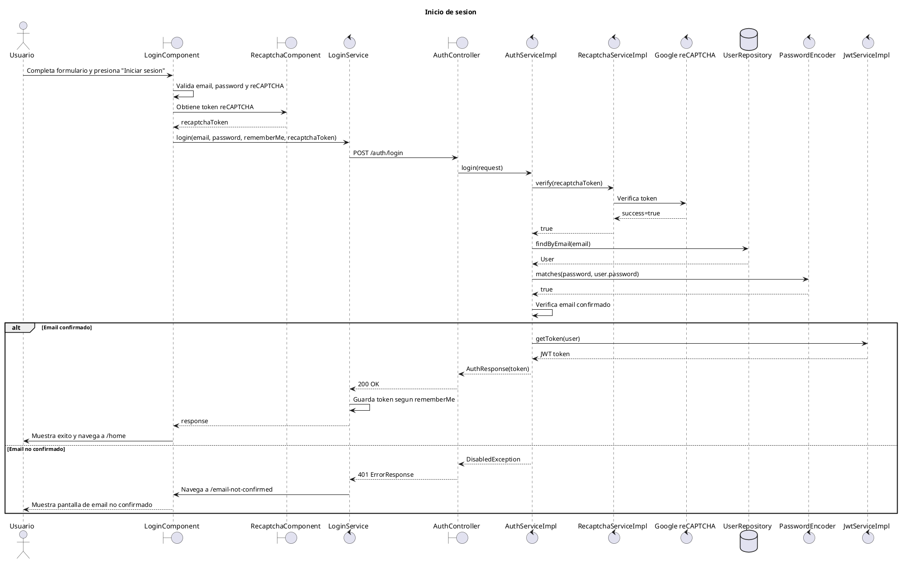

# Diagrama de secuencia - Inicio de sesion

Este diagrama representa el flujo principal de inicio de sesion en MyPresentPast.

El objetivo es mantener el diagrama legible para incluirlo como captura en el documento de desarrollo de producto. Por eso se dejan fuera del flujo principal las validaciones visuales del formulario y los errores, que quedan documentados en las notas posteriores.

## Diagrama PlantUML

## Detalles importantes

- El flujo real valida reCAPTCHA en `AuthServiceImpl.login()` antes de buscar el usuario y validar password.
- La validacion de credenciales se hace con `UserRepository.findByEmail(email)` y `PasswordEncoder.matches(password, user.getPassword())`.
- El endpoint real es `POST /auth/login`.
- El request frontend envia `email`, `password` y `recaptcha_token`. En backend, `LoginRequest` espera `recaptchaToken`; la configuracion `spring.jackson.property-naming-strategy=SNAKE_CASE` permite el mapeo.
- `RecaptchaComponent` carga el script de Google reCAPTCHA, renderiza el widget y emite el token al `LoginComponent`.
- `RecaptchaServiceImpl.verify(token)` llama al servicio externo de Google reCAPTCHA usando `RestTemplate`.
- Si el usuario existe, la password coincide y el email esta verificado, `JwtServiceImpl.getToken(user)` genera el JWT.
- `LoginService` guarda el token en `localStorage` si `rememberMe` esta activo; si no, lo guarda en `sessionStorage`.
- Tras respuesta exitosa, `LoginComponent` muestra mensaje de exito, espera 1 segundo, navega a `/home` y recarga la pagina.

## Alternativas y errores relevantes

Estos casos pueden mencionarse en el documento sin agregarlos al diagrama principal, para evitar que la captura quede demasiado grande:

- Formulario invalido: el frontend muestra error y no envia el request.
- reCAPTCHA no completado: `LoginComponent` muestra error y no envia el request.
- reCAPTCHA invalido o error contra Google: `RecaptchaServiceImpl.verify()` devuelve `false` y `AuthServiceImpl.login()` lanza `BadRequestException`.
- Email inexistente o password incorrecta: se lanza `BadRequestException` con mensaje generico de login fallido.
- Email no verificado: se modelo en el diagrama porque deriva en una pantalla especifica (`/email-not-confirmed`).
- Error de login en frontend: se muestra `Email o contrasena incorrectos.`, se limpia el token reCAPTCHA y se resetea el widget.

## Referencias de codigo

- Frontend: `mypresentpast-frontend/src/app/features/usuarios/sesion/login/login.component.ts`
- Frontend: `mypresentpast-frontend/src/app/features/usuarios/sesion/login/recaptcha.component.ts`
- Frontend: `mypresentpast-frontend/src/app/core/services/login/login.service.ts`
- Frontend: `mypresentpast-frontend/src/app/model/response/auth-response.model.ts`
- Backend: `mypresentpast-backend/src/main/java/com/mypresentpast/backend/controller/auth/AuthController.java`
- Backend: `mypresentpast-backend/src/main/java/com/mypresentpast/backend/dto/request/LoginRequest.java`
- Backend: `mypresentpast-backend/src/main/java/com/mypresentpast/backend/dto/response/AuthResponse.java`
- Backend: `mypresentpast-backend/src/main/java/com/mypresentpast/backend/service/impl/AuthServiceImpl.java`
- Backend: `mypresentpast-backend/src/main/java/com/mypresentpast/backend/service/impl/RecaptchaServiceImpl.java`
- Backend: `mypresentpast-backend/src/main/java/com/mypresentpast/backend/repository/UserRepository.java`
- Backend: `mypresentpast-backend/src/main/java/com/mypresentpast/backend/service/JwtService.java`
- Backend: `mypresentpast-backend/src/main/resources/application.properties`
