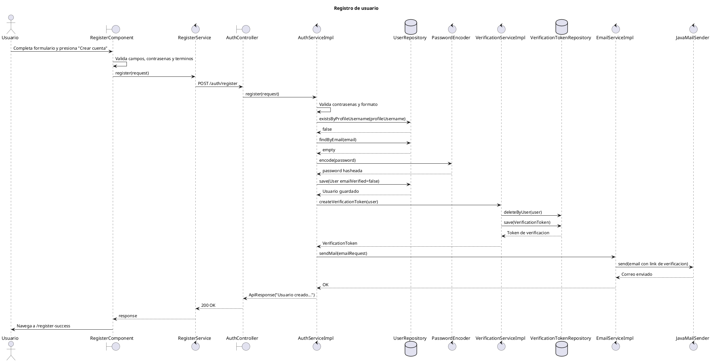

# Diagrama de secuencia - Registro de usuario

Este diagrama representa el flujo principal de registro de usuario en MyPresentPast.

El objetivo es mantener el diagrama legible para incluirlo como captura en el documento de desarrollo de producto. Por eso se deja fuera del flujo principal el detalle posterior de verificacion de email e inicio de sesion.

## Diagrama PlantUML

## Detalles importantes

- El registro no devuelve JWT ni `AuthResponse(token)`.
- El endpoint real de registro es `POST /auth/register`.
- `AuthController.register()` devuelve `ResponseEntity<ApiResponse>`.
- El usuario no queda autenticado al registrarse. Primero debe verificar el email y luego iniciar sesion.
- `AuthServiceImpl.register()` crea un usuario con rol `NORMAL` y `emailVerified=false`.
- El password se guarda hasheado mediante `PasswordEncoder.encode(password)`.
- `VerificationServiceImpl.createVerificationToken(user)` genera un token UUID, lo guarda en `verification_token` y lo asocia al usuario.
- `EmailServiceImpl.sendMail(emailRequest)` envia un correo con link a `http://localhost:4200/verify-success?token=...`.
- Tras respuesta exitosa, `RegisterComponent` navega a `/register-success` y pasa el email por `state`.
- Aunque el backend responde `ApiResponse`, el frontend `RegisterService.register()` esta tipado como `Observable<AuthResponse>`. El componente no usa el token, pero el tipo esta desactualizado y conviene corregirlo.
- Para el producto final, la respuesta de registro no debe incluir ningun token. El token de verificacion debe enviarse solo por email.

## Alternativas y errores relevantes

Estos casos pueden mencionarse en el documento sin agregarlos al diagrama principal, para evitar que la captura quede demasiado grande:

- Formulario invalido: faltan campos, email invalido, usuario con caracteres invalidos, contrasena menor a 8 caracteres o sin mayuscula.
- Terminos no aceptados: el frontend no envia el request y muestra error.
- Contrasenas distintas: el frontend lo detecta y el backend tambien valida `password` contra `confirmPassword`.
- Password invalida segun backend: debe tener minuscula, mayuscula, numero y al menos 8 caracteres.
- `profileUsername` duplicado: `DataIntegrityViolationException`.
- Email ya verificado: `DataIntegrityViolationException`.
- Email existente no verificado con token vigente: `BadRequestException`.
- Email existente no verificado con token vencido: el backend elimina token/usuario anterior y permite registrar de nuevo.
- Error al enviar email: `EmailServiceImpl` lanza `RuntimeException`.

## Mejoras futuras

- Backend: quitar el token de verificacion del mensaje de `ApiResponse` en `AuthServiceImpl.register()`.
- Frontend: corregir el tipo de `RegisterService.register()` de `AuthResponse` a `ApiResponse`. Ya existe `mypresentpast-frontend/src/app/model/response/api-response.model.ts` con el campo `message`.
- La verificacion de email puede documentarse como diagrama separado: `GET /auth/verify?token=...`.

## Referencias de codigo

- Frontend: `mypresentpast-frontend/src/app/features/usuarios/sesion/register/register.component.ts`
- Frontend: `mypresentpast-frontend/src/app/features/usuarios/sesion/register/register.component.html`
- Frontend: `mypresentpast-frontend/src/app/core/services/register/register.service.ts`
- Frontend: `mypresentpast-frontend/src/app/model/request/register-request.model.ts`
- Backend: `mypresentpast-backend/src/main/java/com/mypresentpast/backend/controller/auth/AuthController.java`
- Backend: `mypresentpast-backend/src/main/java/com/mypresentpast/backend/service/AuthService.java`
- Backend: `mypresentpast-backend/src/main/java/com/mypresentpast/backend/service/impl/AuthServiceImpl.java`
- Backend: `mypresentpast-backend/src/main/java/com/mypresentpast/backend/dto/request/RegisterRequest.java`
- Backend: `mypresentpast-backend/src/main/java/com/mypresentpast/backend/repository/UserRepository.java`
- Backend: `mypresentpast-backend/src/main/java/com/mypresentpast/backend/service/impl/VerificationServiceImpl.java`
- Backend: `mypresentpast-backend/src/main/java/com/mypresentpast/backend/repository/VerificationTokenRepository.java`
- Backend: `mypresentpast-backend/src/main/java/com/mypresentpast/backend/service/impl/EmailServiceImpl.java`
